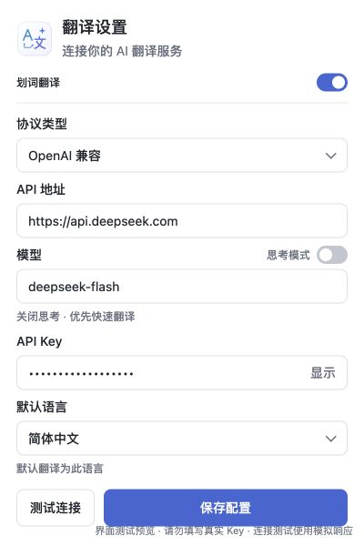
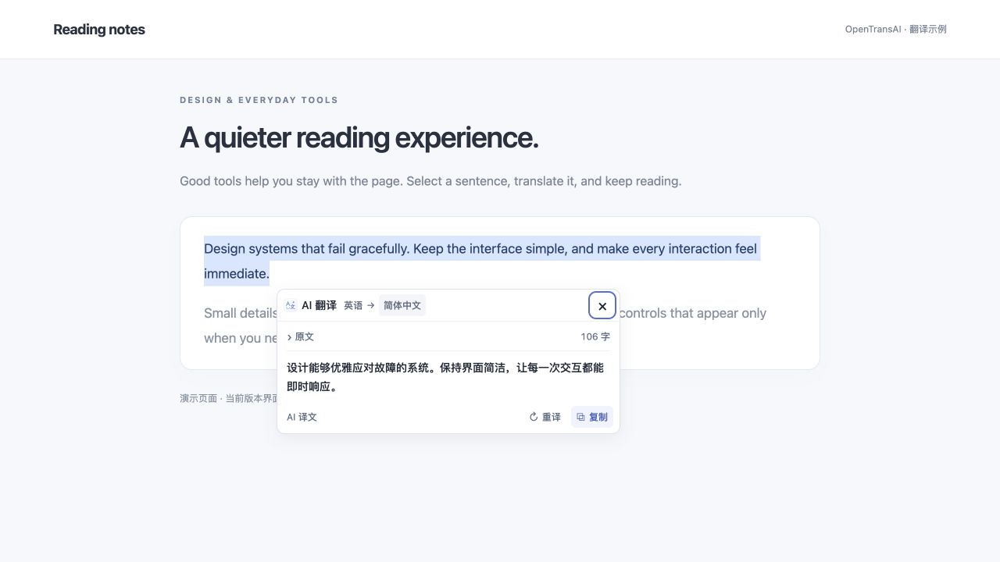

<p align="center">
  
</p>

<h1 align="center">OpenTransAI</h1>

<p align="center">简洁的 Chrome AI 划词翻译扩展</p>
<p align="center"><strong>轻量交互 · AI 直连 · 隐私优先</strong></p>

选中文字，点击小巧的翻译按钮，译文直接出现在当前页面。使用你自己的 AI 服务、模型和 API Key，无需注册项目账号，无需部署项目后端。

**直连你配置的 AI 服务，无项目后台，无中转。** OpenTransAI 不设自有后台服务器，翻译请求由浏览器扩展直接发送到你指定的 AI 接口，API Key 和翻译内容不经过项目方服务器。翻译需要所配置的 AI 服务提供支持；使用云端 AI 时，选中文字会发送给对应服务商。

## 设计目标

| 目标 | 实现方式 |
| --- | --- |
| **简洁** | 划词后显示 26px 纯图标按钮；在当前页面查看译文，在工具栏弹窗中完成配置。 |
| **直连无中转** | 扩展直接请求你配置的 AI 服务，不依赖项目自有后台，Key 与翻译内容不经过项目方服务器。 |
| **隐私安全** | 自带 API Key，直接连接指定 AI 服务；不经过项目中转，不采集翻译历史，不做遥测或云同步。 |

## 界面预览

以下截图由当前版本代码实际渲染；配置使用示例值，译文使用演示数据，不包含真实 API Key。

### 配置弹窗

点击工具栏图标即可配置 AI 服务、模型、思考模式和默认语言，保存后自动关闭。

<p align="center">
  
</p>

### 划词翻译示例

在网页中选中英文，点击翻译按钮，即可在当前页面查看中文译文。原文默认折叠，底部提供重译和复制操作。

<p align="center">
  
</p>

## 使用体验

- **按需翻译**：仅选中文字不会发送请求，点击翻译按钮后才调用 AI。
- **自动选择方向**：识别原文语言，自动在默认语言和英语之间切换。
- **流式显示**：收到片段即显示，配合轻微淡入，减少等待完整结果的时间。
- **轻量浮窗**：默认约 440px 宽，高度不超过可视窗口的 70%，靠近边缘时自动调整位置。
- **专注阅读**：原文默认折叠并显示字数；长原文与译文分别滚动，顶部语言栏和底部操作固定。
- **随手操作**：复制、重译、按 `Esc` 关闭；支持浅色与深色页面样式。
- **自由配置**：自选协议、API 地址、模型和 Key；保存后配置弹窗自动关闭。
- **明确等待状态**：显示等待、思考或生成阶段及已用时；支持 DeepSeek 官方接口的思考开关。

## 安装与开始使用

需要 **Chrome 123 或更高版本**。直接加载源码无需 Node.js，也无需安装依赖。

1. 下载或克隆本仓库，并解压到本地。
2. 打开 `chrome://extensions`，开启右上角的 **开发者模式**。
3. 点击 **加载已解压的扩展程序**，选择仓库内的 **`extension` 文件夹**。
4. 点击 Chrome 工具栏中的 OpenTransAI 图标，填写 **协议类型、API 地址、模型、API Key、默认语言**。
5. 点击 **保存配置**，按提示允许访问你填写的 AI 服务地址。也可通过 **测试连接** 检查当前配置。
6. 刷新网页，选中文字，点击旁边的翻译图标。

更新扩展文件后，请先在 `chrome://extensions` 中点击 **重新加载**，再刷新需要翻译的网页。

## 接入 AI 服务

| 协议 | 可接入的服务 | 地址填写方式 |
| --- | --- | --- |
| OpenAI 兼容 | OpenAI、DeepSeek、自定义兼容服务或本机模型服务 | 填写基础地址，例如 `https://api.deepseek.com/v1`；自动追加 `/chat/completions`。 |
| Anthropic | Anthropic API | 填写基础地址，例如 `https://api.anthropic.com/v1`；自动追加 `/messages`。 |
| Google Gemini | Gemini API | 填写基础地址，例如 `https://generativelanguage.googleapis.com/v1beta`。 |

**模型名称填写对应服务实际可用的 Model ID。** 模型需要支持对话和 JSON 文本输出；即时显示分片还需要服务端支持 SSE 流式响应。模型权限、费用和可用名称以所选服务为准。

切换协议类型会保留当前填写的 API 地址、模型、API Key 和默认语言，保存后生效。

OpenAI 兼容和 Anthropic 也可以填写完整的上述接口地址。远程地址要求 HTTPS；本机服务允许使用 `localhost`、`127.0.0.1` 或 `[::1]` 的 HTTP 地址。

### 使用本机模型

如果希望翻译请求留在设备上，可以自行运行兼容的本机模型服务，然后配置：

```text
协议类型：OpenAI 兼容
API 地址：http://127.0.0.1:端口/v1
模型：本机服务提供的模型 ID
API Key：本机服务要求的 Key；不校验时可填写 local
```

将 `端口` 替换为实际端口。插件不内置模型；只有模型服务也在本机处理且不向外转发时，翻译内容才可留在本机。

### 自动翻译规则

默认语言初始为 **简体中文**，可以在配置中修改。

| 原文的主要语言 | 翻译为 |
| --- | --- |
| 与默认语言不同 | 默认语言 |
| 与默认语言相同 | 英语 |

例如，默认中文时：英语 → 中文，日语 → 中文，中文 → 英语。简繁中文及同一语言的地域变体按同一种语言处理；默认语言为英语时，目标语言始终为英语。

## 隐私与数据流向

```text
选中文字 → 点击翻译 → 浏览器扩展 → 你配置的 AI 服务 → 当前页面显示译文
```

**没有 OpenTransAI 中转环节。数据去向由你的 AI 配置决定。**

- **本地保存配置**：API Key 与设置保存在当前 Chrome 配置文件的 `chrome.storage.local`，不做云同步。存储区仅允许扩展可信页面访问，网页内容脚本不能读取 Key。
- **按需发送内容**：翻译请求携带选中文字、翻译指令、语言和模型配置，Key 用于向指定服务认证。不上传整页内容、网页地址或浏览历史。
- **不建立用户档案**：无项目账号、广告、遥测或持久化翻译历史；不加载远程可执行代码。
- **限制请求与渲染**：AI 地址在保存或测试时按需授权；请求不携带浏览器 Cookie、不跟随重定向。译文按纯文本显示。
- **连接测试可预期**：点击“测试连接”会向当前配置的 AI 服务发送固定短句 `Hello, world!`，不会自动保存配置。

使用云端模型时，服务商仍会收到翻译请求，其数据保留和使用规则由服务商决定。本地存储不是加密密钥链，拥有该浏览器配置文件访问权限的人仍可能读取 Key；请勿将真实 Key 写入源码或提交到 GitHub。

自动显示划词按钮需要扩展在 HTTP(S) 网页运行内容脚本；AI 服务域名的网络权限在保存或测试配置时申请。可以通过配置窗口的 **划词翻译** 开关随时关闭功能。

## 常见问题

**为什么流式翻译开始前仍有停顿？**

服务连接、模型排队和思考都可能影响首段响应时间。扩展在收到译文片段后立即显示，不人为延迟。思考开关默认关闭，目前仅适用于 DeepSeek 官方地址的 OpenAI 兼容接口；开启后显示基于实际事件的阶段说明，不展示或保存原始推理文本。如果服务端只返回完整响应，译文会在响应到达后显示。

**哪些页面可以使用？**

支持普通 HTTP(S) 网页文本及常见文本输入区域，密码框不会触发。Chrome 内部页面、扩展商店、浏览器内置 PDF 阅读器、图片或 canvas 内的文字及部分特殊编辑器不支持；未申请 `file://` 页面访问权限。

**长文本或请求失败时会怎样？**

单次选区上限为 12,000 个字符。断流会保留已显示片段并标记未完成，可点击重译。关闭翻译框会取消当前请求，旧结果不会覆盖新的选区。

## 开发

原生 HTML、CSS 和 JavaScript，采用 Chrome Manifest V3，无第三方运行依赖。

开发与检查需要 **Node.js 18+**，打包还需要系统 `zip` 命令；无需运行 `npm install`。

```sh
npm test         # 语言规则、协议、流式响应与后台消息边界
npm run check    # 清单、JavaScript 语法、CSP 与图标资源
npm run preview  # 本地交互预览：http://127.0.0.1:4173/
npm run package  # 输出 dist/OpenTransAI/ 和 dist/OpenTransAI.zip
```

预览页使用实际界面代码和独立的 Chrome / AI 测试适配器，不连接真实 AI 服务；不要在预览中填写真实 Key。打包产物不包含测试适配器。使用打包产物时，解压 ZIP 后加载其中的 `OpenTransAI` 文件夹。

```text
extension/          可直接加载的 Chrome 扩展
  content.js        划词按钮、翻译浮窗与交互
  popup.*           工具栏配置窗口
  lib/              AI 协议、流式解析与后台请求处理
  icons/            浅色图标与保留的原暗色资源
tests/              核心测试及浏览器交互测试
scripts/            检查、预览与打包工具
docs/               设计说明与验证记录
```

查看 [设计说明](docs/design.md) 与 [验证记录](docs/verification.md)。
